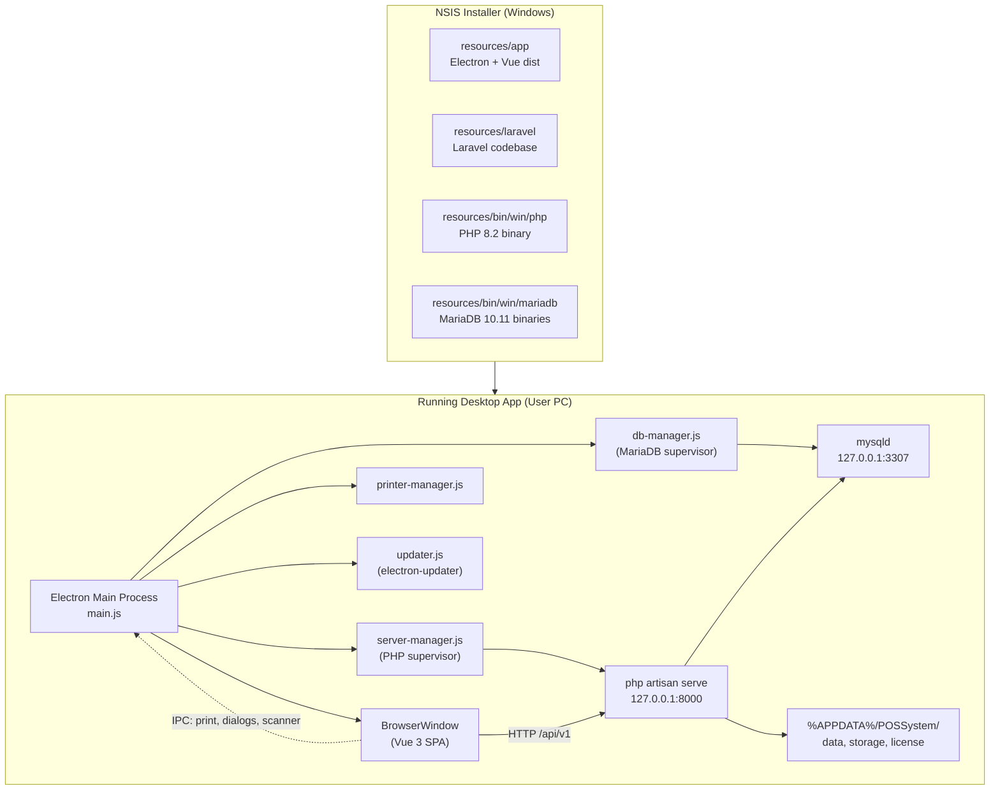
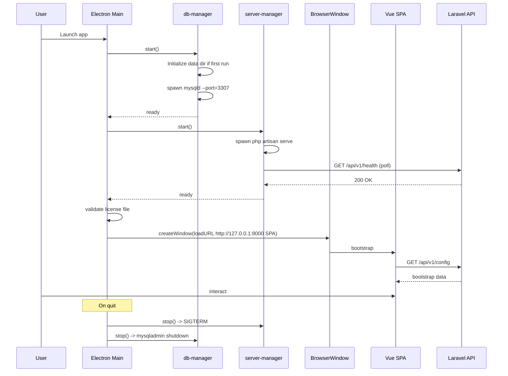

# Design Document: Desktop App Conversion (Option B)

## Overview

This feature converts the existing Laravel 9 POS system at the workspace root into a Windows desktop application. The shipping artifact is a single NSIS installer that contains an Electron shell, a Vue 3 SPA, the Laravel codebase, a bundled PHP runtime, and a bundled MariaDB server. At runtime the Electron main process supervises a local PHP HTTP server on `127.0.0.1:8000` and a MariaDB instance on `127.0.0.1:3307`. The Vue SPA communicates with Laravel exclusively through a versioned `/api/v1/` JSON API authenticated with Laravel Sanctum.

The conversion is offline-first: every existing module (Essentials, Accounting, AssetManagement, Cms, Connector, Crm, Ecommerce, FieldForce, Manufacturing, ProductCatalogue, Project, Repair, Spreadsheet, Superadmin, Woocommerce, AiAssistance, Hms, InboxReport, CustomDashboard) must operate without internet access for its core flows. Online-only features (SMS, email, Pusher, online payment gateways, license refresh) are gated behind an `online?` capability check and degrade gracefully. The existing Envato-server `pos_boot()` license check is replaced with offline asymmetric-signature validation against a locally stored license file.

Blade is removed from the user-facing surface. The only Blade artifacts retained are receipt templates rendered by `receiptContent()` and consumed by an Electron print pipeline. All other Blade views are reimplemented as Vue 3 single-file components.

## Architecture

### Runtime topology



### Process lifecycle



### Repository layout

The desktop application introduces three new top-level directories alongside the existing Laravel root. The Laravel root is preserved unchanged structurally; new code is added (API controllers, resources, license service) but no existing controller is moved.

```
pos_system/                     existing Laravel root
├── app/                        existing
├── Modules/                    existing (19 enabled modules)
├── routes/
│   ├── api.php                 expanded: registers /api/v1 routes
│   └── web.php                 trimmed: receipt + auth fallback only
├── ...
electron/                       NEW
├── main.js
├── preload.js
├── server-manager.js
├── db-manager.js
├── printer-manager.js
├── updater.js
├── license-validator.js
├── ipc-handlers.js
└── package.json
frontend/                       NEW
├── src/
│   ├── main.js
│   ├── App.vue
│   ├── router/
│   ├── stores/
│   ├── api/
│   ├── components/
│   ├── views/
│   └── modules/                Vue mirrors of Laravel Modules/*
├── vite.config.js
└── package.json
bin/                            NEW (committed pointers, populated by build)
└── win/
    ├── php/                    PHP 8.2 NTS x64 + extensions
    └── mariadb/                MariaDB 10.11 portable
.kiro/specs/desktop-app-conversion/  this spec
```

## Components and Interfaces

### Component 1: Electron main process (`electron/main.js`)

**Purpose**: Application entry point. Owns the lifecycle of the Vue window, the PHP server, the MariaDB server, and the license check. All native OS interactions originate here.

**Responsibilities**:
- Resolve a per-user writable data directory (`%APPDATA%/POSSystem/`) for MariaDB data, Laravel `storage/`, license file, and logs. Read-only files in the install dir are copied or symlinked into the writable dir on first run.
- Boot dependencies in order: DB → Laravel server → license → window.
- Trap `before-quit`, `window-all-closed`, and `SIGINT` to stop child processes cleanly.
- Bind a single-instance lock so a second launch focuses the existing window instead of starting a new PHP/MariaDB pair.
- Wire IPC handlers for printing, file dialogs, scanner access, and version reporting.

### Component 2: Server manager (`electron/server-manager.js`)

**Purpose**: Supervise the PHP `artisan serve` process.

**Responsibilities**: Spawn PHP with `--host=127.0.0.1` only (never bind 0.0.0.0). Wait for `/api/v1/health` to return 200 before declaring ready. Restart on crash with bounded retries. Forward logs.

### Component 3: Database manager (`electron/db-manager.js`)

**Purpose**: Supervise the bundled MariaDB process and ensure schema readiness.

**Responsibilities**:
- First-run initialization: create data directory, install system tables, set a randomly generated root password, create application user/database, write Laravel `.env` to use them.
- Subsequent runs: just start `mysqld` against the existing data directory.
- Run `php artisan migrate --force` on every start so module migrations apply across upgrades.
- Stop cleanly via `mysqladmin shutdown` to avoid InnoDB recovery on next boot.

### Component 4: Printer manager (`electron/printer-manager.js`)

**Purpose**: Centralize all printing concerns.

**Responsibilities**: Receive raw receipt HTML from Vue (via IPC), pick the configured target (system or ESC/POS), and dispatch. ESC/POS support is optional in v1 but the interface is in place.

### Component 5: License validator (`electron/license-validator.js`)

**Purpose**: Replace `pos_boot()` with offline cryptographic validation.

**Responsibilities**:
- Parse and verify `license.dat`. The file is a JSON document with `payload`, `signature`, `publicKeyId`.
- Verify the signature with an Ed25519 public key embedded as a constant in compiled JavaScript. The public key is also pinned via SHA-256 hash inside `license-validator.js` and re-hashed at startup; any mismatch yields `TAMPERED_PUBLIC_KEY`.
- The Electron build is signed with an Authenticode certificate; OS-level signature protects the embedded public key from naive replacement on disk.
- Validation is purely local. No HTTP calls.
- Provide a UI flow for "Install license file" that writes to `%APPDATA%/POSSystem/license.dat`.

The Laravel `pos_boot()` function is gutted. It becomes a no-op stub that always returns valid, because the desktop shell has already gated the app at startup. This keeps any code paths that call it from breaking.

### Component 6: Preload bridge (`electron/preload.js`)

**Purpose**: Expose a tightly-scoped, typed API surface to the renderer via `contextBridge`. The renderer never gets direct `ipcRenderer` or Node access.

**Responsibilities**: Provide a single source of truth (`@/api/electron.ts`) that the Vue SPA consumes. The SPA never touches `window.require` or `process`.

### Component 7: Laravel API layer (`app/Http/Controllers/Api/*`, `routes/api.php`)

**Purpose**: Provide the JSON-only contract the Vue SPA depends on.

**Module API discovery**: `nwidart/laravel-modules` exposes each module under `Modules/{Name}/Routes/api.php`. A new `App\Providers\ModuleApiRouteProvider` (registered in `config/app.php`) iterates the keys of `modules_statuses.json`, and for any module whose flag is `true` and whose `Routes/api.php` exists, mounts that file under `/api/v1/modules/{kebab-name}/`. Modules without an `api.php` are silently skipped. No edits to the module source are required to register; modules opt in by adding the file.

**Responsibilities**:
- Every controller under `app/Http/Controllers/Api/` returns `JsonResponse` only. They never render Blade and never use the `session()` helper.
- Authentication is Sanctum stateful for same-origin (Vue SPA on `http://127.0.0.1:8000`), so cookies are used and CSRF is enforced via Sanctum's `EnsureFrontendRequestsAreStateful`.
- `SetSessionDataApi` middleware is a port of the existing `SetSessionData` web middleware that stuffs business/user/permission context into a request-scoped container instead of session, so existing helper functions that read business context continue to work inside API controllers.
- Resource classes under `app/Http/Resources/` standardize JSON shape and include hidden field stripping (no `password`, no `api_token`).
- Validation uses Form Request classes per controller, returning Laravel's standard 422 JSON error envelope.

### Component 8: Vue 3 SPA (`frontend/`)

**Purpose**: Single-page application that replaces every Blade-rendered screen.

**Key stores**:

| Store | Responsibility |
|---|---|
| `authStore` | Sanctum cookie + CSRF flow, current user, permissions, business |
| `bootstrapStore` | App config: currencies, tax rates, locations, modules enabled |
| `posStore` | Cart lines, customer, payment lines, register state |
| `productStore` | Product cache + search, invalidation on save |
| `connectivityStore` | `online` flag, last heartbeat, reachable services list |
| `notificationStore` | Toasts, system alerts |
| `licenseStore` | License status surfaced from Electron preload |

**Connectivity gating**: every API service that wraps an online-only feature reads `connectivityStore.online` first. If offline, the service returns a typed `OfflineUnavailable` error that views render as a friendly disabled state. The connectivity indicator in `App.vue`'s top bar is bound to `connectivityStore.online`.

### Component 9: Connectivity store

**Purpose**: Single source of truth for "is the device online and can it reach external services we care about right now?"

**Responsibilities**: Drive the UI's connection-state indicator and short-circuit online-only calls before they hit Laravel. Laravel additionally has a server-side `OnlineGuard` middleware applied to routes that talk to external services (SMS, email send, Pusher publish, license refresh, payment gateway) which returns 503 with `{"error":"online_required"}` when offline detection fails.

## Data Models

### Model 1: API authentication

```pascal
STRUCTURE LoginRequest
  email: String                // RFC 5322
  password: String             // 6..255 chars
  device_name: String          // "POS Desktop v1.0.0"
END STRUCTURE

STRUCTURE LoginResponse
  user: UserResource
  business: BusinessResource
  permissions: List<String>
  locations: List<BusinessLocationResource>
  currency: CurrencyResource
  modules_enabled: List<String>
END STRUCTURE

STRUCTURE ErrorEnvelope
  message: String
  errors: Map<String, List<String>>|null
  code: String
END STRUCTURE
```

### Model 2: License file

```pascal
STRUCTURE LicensePayload
  licenseId: UUID
  customerEmail: String
  productId: "pos-desktop-v1"
  issuedAt: ISO8601
  expiresAt: ISO8601 | null
  machineFingerprint: String | null
  features: List<String>
END STRUCTURE

STRUCTURE LicenseFile
  payload: LicensePayload
  signature: Base64String        // Ed25519 over UTF-8 canonical JSON of payload
  publicKeyId: String            // e.g. "v1"
END STRUCTURE
```

### Model 3: Versioned API envelope

```pascal
STRUCTURE SingleResource<T>
  data: T
END STRUCTURE

STRUCTURE Collection<T>
  data: List<T>
  meta: { current_page, per_page, total, last_page }
  links: { first, last, prev, next }
END STRUCTURE

STRUCTURE ErrorEnvelope
  message: String
  code: String
  errors: Map<String, List<String>> | null
END STRUCTURE
```

### Model 4: IPC message contracts

```pascal
STRUCTURE PrintReceiptRequest
  html: String
  target: "system_default" | "named:{name}" | "escpos:{deviceId}"
  copies: Integer
  silent: Boolean
END STRUCTURE

STRUCTURE PrintResult
  ok: Boolean
  error: String | null
END STRUCTURE
```

### Model 5: Connectivity

```pascal
STRUCTURE OnlineCapability
  online: Boolean
  lastCheckedAt: ISO8601
  consecutiveFailures: Integer
END STRUCTURE
```

## Correctness Properties

### Property 1: License signature verification soundness

For any `LicenseFile` whose `signature` is not a valid Ed25519 signature over the canonical JSON of its `payload` under the embedded public key matching `publicKeyId`, `licenseValidator.validate()` SHALL return `valid = false` with `reason ∈ { BAD_SIGNATURE, TAMPERED_PUBLIC_KEY }`.

**Validates: Requirements 6.1, 6.4, 6.5, 7.2**

### Property 2: Offline call gating

For any API service call wrapping an online-only feature, if `connectivityStore.online` is `false` at the time of invocation, the call SHALL NOT issue an HTTP request to an external host and SHALL return an `OfflineUnavailable` error.

**Validates: Requirements 12.1, 12.2, 12.3**

### Property 3: API JSON purity

For any request to a path matching `/api/v1/*`, the response `Content-Type` SHALL be `application/json` (or `application/problem+json`), and the response body SHALL be parseable JSON. No path under `/api/v1/*` SHALL return Blade-rendered HTML or a redirect to a Blade view.

**Validates: Requirements 8.1, 8.2, 8.3, 8.4**

### Property 4: Process supervision invariant

For any state where the Electron main process is running and the user has not requested quit, both the bundled MariaDB process and the bundled PHP server process SHALL be running, OR the application SHALL be displaying a non-dismissible startup-error screen.

**Validates: Requirements 2.1, 2.2, 2.6, 2.7**

### Property 5: Receipt round-trip

For any sale persisted via `POST /api/v1/pos/sales`, `GET /api/v1/pos/sales/{id}/receipt` SHALL return receipt HTML such that the `printReceipt` IPC call accepts that HTML without error and the rendered PDF preview contains all line items, totals, and payment lines from the persisted sale.

**Validates: Requirements 13.1, 13.2, 13.3, 13.4, 13.5**

### Property 6: Module API mounting completeness

For every module name `m` where `modules_statuses.json[m] = true` AND `Modules/{m}/Routes/api.php` exists on disk, every route declared in that file SHALL be reachable under `/api/v1/modules/{kebab(m)}/...` after Laravel boots.

**Validates: Requirements 9.1, 9.2, 9.3, 9.4, 9.5**

### Property 7: Sanctum cookie flow integrity

For any successful `POST /api/v1/auth/login` followed by an authenticated `GET /api/v1/auth/me` from the same browser context, the user identity returned by `me` SHALL equal the user identity authenticated by `login`. After `POST /api/v1/auth/logout`, any subsequent call to `/api/v1/auth/me` SHALL return 401 with `code = "unauthenticated"`.

**Validates: Requirements 10.1, 10.2, 10.3, 10.4, 10.6**

### Property 8: First-run idempotence of DB initialization

For any application launch on a host where `%APPDATA%/POSSystem/mariadb-data/` already exists and contains an initialized data dictionary, `db-manager.start()` SHALL NOT re-run `mariadb-install-db` and SHALL NOT alter the existing `pos_app` user's password.

**Validates: Requirements 5.1, 5.2, 5.3**

### Property 9: Graceful shutdown

For any quit triggered through the OS or the in-app menu, after `app.on('before-quit')` resolves, both child processes (PHP and MariaDB) SHALL have exited (verified via PID check), and InnoDB SHALL have flushed (verified by absence of `*.ibd` write activity) before the Electron process exits.

**Validates: Requirements 3.1, 3.2, 3.3, 3.4, 3.5**

### Property 10: License file tamper resistance

For any modification to the bytes of `%APPDATA%/POSSystem/license.dat` after installation that does not produce a valid Ed25519 signature under an embedded public key, the next call to `licenseValidator.validate()` SHALL return `valid = false`.

**Validates: Requirements 7.1, 7.2, 6.5**

### Property 11: Connectivity indicator consistency

For any UI render where `connectivityStore.online = false`, the global connection-state indicator in `App.vue` SHALL be visible AND every action button bound to an online-only feature SHALL be in a disabled state with a tooltip explaining offline mode.

**Validates: Requirements 11.3, 11.4, 11.5, 11.6**

## Error Handling

### Error Scenario 1: PHP server fails to start
**Condition**: `server-manager.start()` cannot reach `/api/v1/health` within 30 seconds, or the spawned process exits with a non-zero code 3 times within 60 seconds.
**Response**: Electron displays a fatal error screen with the tail of `logs/laravel-server.log` and a "Copy diagnostics" button. No window is created.

### Error Scenario 2: MariaDB data dir corrupted
**Condition**: `mysqld` exits during startup with InnoDB recovery failure, or `php artisan migrate` fails repeatedly.
**Response**: Electron shows a recovery dialog with three options: "Run repair", "Restore from backup", "Reset database (destroys data)".

### Error Scenario 3: License invalid or missing
**Condition**: `licenseValidator.validate()` returns any non-OK reason.
**Response**: Vue routes to a `/license` view. Browse for license file, install via electronAPI.

### Error Scenario 4: Offline-only feature attempted while offline
**Condition**: User invokes an action whose `online?` capability check returns false.
**Response**: Frontend short-circuits before HTTP. If a request reaches Laravel, the `OnlineGuard` middleware returns 503 `{"code":"offline_required"}`.

### Error Scenario 5: API authentication failure
**Condition**: Any protected `/api/v1/*` request without a valid Sanctum session.
**Response**: Laravel returns 401 with `{"message":"Unauthenticated.","code":"unauthenticated"}`. Axios interceptor redirects to `/login`.

### Error Scenario 6: Receipt printer not found / print fails
**Condition**: `printer-manager.printReceiptHtml` cannot resolve the configured printer.
**Response**: IPC returns `{ok:false, error:"printer_not_found"}`. Vue offers "Print to PDF" fallback.

### Error Scenario 7: Auto-update download fails
**Condition**: `electron-updater` cannot reach the update server or signature check fails.
**Response**: Update silently skipped. Retried on next launch.

### Error Scenario 8: Concurrent app launch
**Condition**: User double-clicks the launcher while the app is already running.
**Response**: Single-instance lock prevents a second PHP/MariaDB pair from spawning; the existing window is focused.

## Testing Strategy

### Unit Testing Approach
- **Laravel API controllers**: Feature tests under `tests/Feature/Api/*` using Laravel's built-in HTTP testing. Target ≥80% coverage on `app/Http/Controllers/Api/`.
- **Resource shape tests**: For each `Resource` class, snapshot test the JSON shape.
- **Electron Node modules**: Vitest-based unit tests for `license-validator.js`, `server-manager.js`, `db-manager.js`, `connectivityStore`.
- **Vue components**: Vitest + `@vue/test-utils`. Focus on `posStore` arithmetic, form validation in critical views, connectivity gating.

### Property-Based Testing Approach

PBT is appropriate for:
- License signature validation (Property 1, 10): generate arbitrary byte mutations of a valid license.
- Receipt round-trip (Property 5): generate arbitrary sales, persist via API, fetch receipt, assert all line items appear.
- API envelope purity (Property 3): for any random valid `/api/v1/*` request, assert response is JSON-parseable.
- Module mounting (Property 6): generate arbitrary `modules_statuses.json` toggles, boot Laravel, assert mounted routes match.

PBT is NOT appropriate for:
- Electron build artifacts (NSIS installer): use snapshot/integration smoke tests instead.
- Vue UI rendering and CSS layout: snapshot tests + manual smoke testing.
- Native print output: integration test on a real device.

**Property test library**:
- PHP: `pestphp/pest` with `pest-plugin-faker` for generators.
- TypeScript (Electron + Vue): `fast-check`.

Each property test uses ≥100 iterations.

### Integration Testing Approach
- **Electron end-to-end**: Playwright with `_electron` runner. Smoke flow: launch → login → POS → create sale → print PDF → quit.
- **PHP↔MariaDB**: Test harness spins up bundled `mysqld` against temp data dir, runs migrations, asserts schema.
- **Auto-update**: Mock the update feed, assert `electron-updater` downloads and verifies signature.

## Performance Considerations

- Cold start budget: ≤6 seconds from launcher click to login screen visible on Windows 10/8GB/SATA SSD.
- POS product search: results within 150ms for catalogs up to 50,000 products.
- Reports with large date ranges: server-side pagination + streaming JSON.
- Memory: target ≤500 MB resident for Electron main + renderer + PHP + MariaDB combined.

## Security Considerations

- **Network exposure**: PHP and MariaDB bind only to `127.0.0.1`. Windows Firewall rule allows loopback only.
- **Credentials at rest**: MariaDB root password and `pos_app` password stored using Windows DPAPI (`electron.safeStorage`).
- **CSRF**: Sanctum stateful enforces CSRF on all state-changing API requests.
- **Authn**: Sanctum stateful only. Passport routes remain registered but the SPA only uses Sanctum.
- **License key protection**: Ed25519 public key embedded as constant byte array; Authenticode-signed binary is the trust boundary.
- **Auto-update integrity**: `electron-updater` verifies installer signatures against the embedded publisher cert.
- **Offline data**: Local SQL database can be backed up by user from Settings → Backups.
- **Logs**: `logs/laravel-server.log`, `logs/electron.log`, `logs/mariadb.err` go to `%APPDATA%/POSSystem/logs/` and rotate at 10 MB.

## Dependencies

### New Node dependencies (Electron)
- `electron` ^28
- `electron-builder` ^24
- `electron-updater` ^6
- `tweetnacl` (Ed25519 verify)
- `serialport` (optional, for ESC/POS over USB)
- `winston` (logging)

### New Node dependencies (Vue frontend)
- `vue` ^3.4
- `vite` ^5
- `vue-router` ^4
- `pinia` ^2
- `axios` ^1.6
- `@vueuse/core`
- `tailwindcss` ^3
- `chart.js`, `vue-chartjs`
- `@headlessui/vue`
- `fast-check` (devDependency)

### New PHP dependencies
- `laravel/sanctum` ^3
- `pestphp/pest` (dev)

### Bundled Windows binaries
- PHP 8.2 NTS x64 from static-php-cli, with extensions: `mbstring`, `pdo_mysql`, `gd`, `zip`, `intl`, `bcmath`, `xml`, `curl`, `openssl`, `fileinfo`.
- MariaDB 10.11.x portable Windows ZIP.

### External services (online-only, optional)
- SMS gateways (Twilio, Nexmo, etc.) — gated behind `connectivityStore.online`.
- Pusher / Laravel Reverb — gated behind `connectivityStore.online`.
- Online payment gateways (Stripe, Razorpay, etc.) — gated behind `connectivityStore.online`.
- Update feed (GitHub Releases or self-hosted) — used by `electron-updater`.
